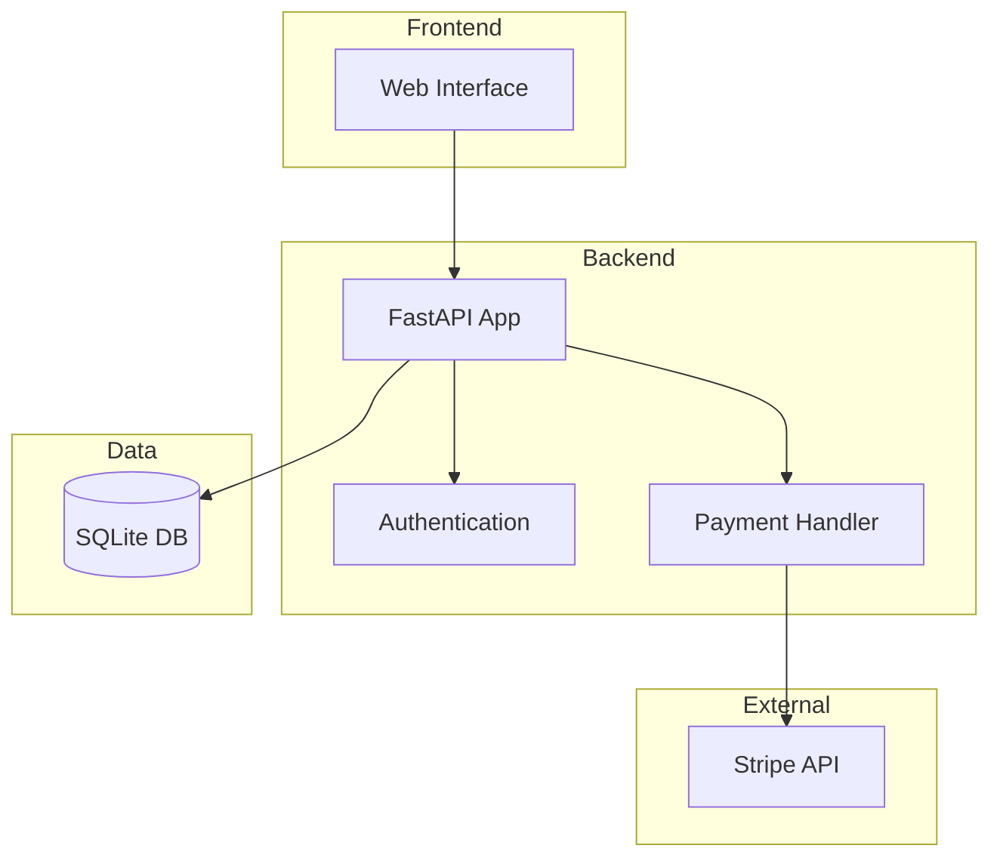
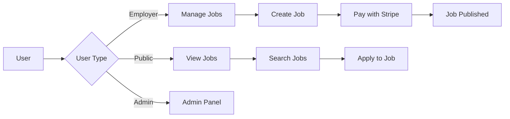
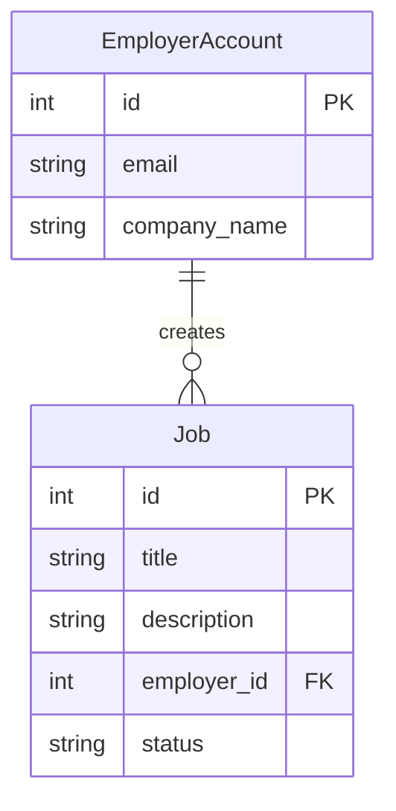
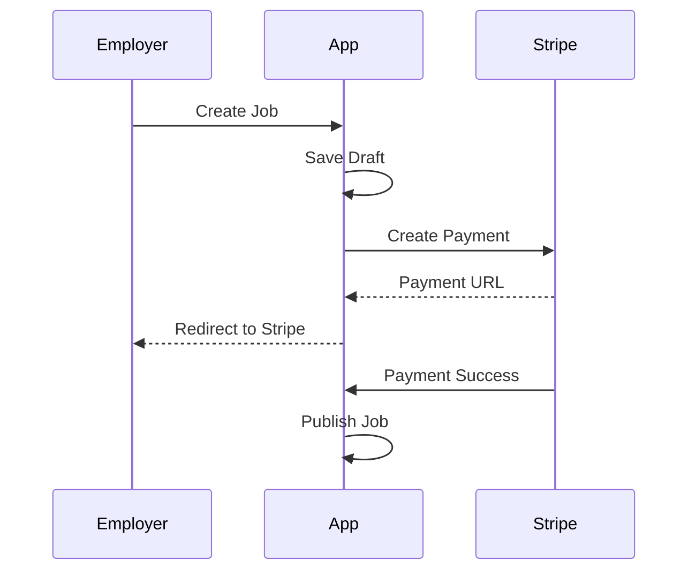
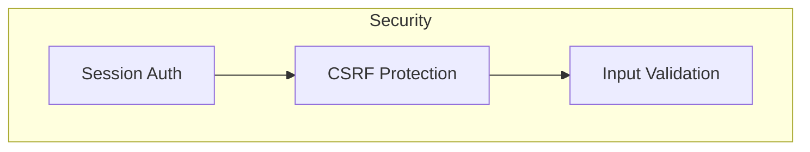

# Job Board Application Architecture

## System Overview

## User Flow

## Database Schema

## Payment Flow

## Security Layers

This simplified architecture shows:

1. **Clean Separation**: Frontend, Backend, Data, and External services
2. **Simple User Flows**: Three main user types with clear paths
3. **Core Database**: Essential entities only
4. **Payment Process**: Straightforward Stripe integration
5. **Security**: Basic but effective security layers 